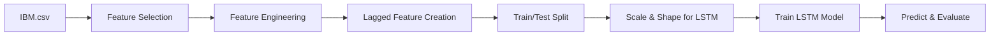

# LSTM & Lagged Days Notebook — Full Walkthrough

This document explains how the [LSTM_and_Lagged_days.ipynb](file:///C:/Users/Aaditya%20Saini/Desktop/stock_price_prediction_model/predicition_pipeline/LSTM_and_Lagged_days.ipynb) notebook works, step by step.

---

## 1. Overview

The notebook builds an **LSTM (Long Short-Term Memory)** neural network to predict IBM's stock closing price. It uses **time-lagged features** — past values of the stock's own closing price and external index data (QQQ, S&P 500, DJIA) — as inputs.



---

## 2. Cell-by-Cell Breakdown

### Cell 1 — Imports
Imports all required libraries:
- **pandas, numpy** — data manipulation  
- **matplotlib, seaborn** — visualization  
- **sklearn** — `MinMaxScaler`, `metrics`, `train_test_split`  
- **keras** — `Sequential`, `LSTM`, `Dense`, `Dropout`  

### Cell 2 — Load Data & Select Features
```python
Stock = pd.read_csv('IBM.csv')
features_selected = ['Open', 'High', 'Low', 'QQQ(t-1)', 'Snp(t-1)', 'DJIA(t-1)', 'Close(t)']
df_Stock = Stock[features_selected]
df_Stock = df_Stock.iloc[:-100, :]              # Drop last 100 rows
df_Stock = df_Stock.rename(columns={'Close(t)': 'Close'})
df_Stock['Diff']     = df_Stock['Close'] - df_Stock['Open']
df_Stock['High-low'] = df_Stock['High']  - df_Stock['Low']
```

- Reads pre-processed [IBM.csv](file:///C:/Users/Aaditya%20Saini/Desktop/stock_price_prediction_model/predicition_pipeline/IBM.csv) (5,350 rows × 63 columns including technical indicators and lagged index data).
- Selects **7 key columns** — OHLC prices plus 1-day-lagged index closes.
- Removes the last 100 rows (held out separately).
- Renames `Close(t)` → `Close`.
- Creates two **engineered features**: daily price change (`Diff`) and daily range (`High-low`).

### Cell 3 — Visualization
Plots the `High`, `Low`, and `Close` price history to visually inspect trends and volatility.

### Cell 4 — `prepare_lagged_features()` Function
Creates additional time-lagged columns:

| Step | What it does |
|------|-------------|
| 1 | Creates `Close(t-1)` through `Close(t-20)` by shifting the `Close` column |
| 2 | Creates lags of `QQQ(t-1)`, `Snp(t-1)`, `DJIA(t-1)` — shifts 1–5 days → produces columns like `QQQ(t-1)(t-1)` through `QQQ(t-1)(t-5)` |
| 3 | Drops the original (un-lagged) index columns |
| 4 | Removes the first `max(lag_stock, lag_index) + 1` rows to eliminate NaN values created by shifting |

> [!IMPORTANT]
> Because the CSV already contains pre-computed lagged features (e.g., `QQQ(t-1)`), calling this function creates **lags-of-lags** — e.g., `QQQ(t-1)(t-2)` means "QQQ's close from 2 days before the already 1-day-lagged value" = effectively 3 days ago.

### Cell 5 — Apply the Function
```python
df_Stock = prepare_lagged_features(df_Stock, lag_stock=20, lag_index=5)
```
After this, the DataFrame has **41 columns** (including `Close` as the target).

### Cell 6 — Drop Original Price Columns
```python
df_Stock = df_Stock.drop(columns=['Open', 'High', 'Low'])
```
Removes `Open`, `High`, `Low` — keeping only engineered/lagged features and the target (`Close`). Result: **38 columns**.

### Cell 7 — Slice the Data
```python
df_Stock = df_Stock.iloc[31:452, :]  # 421 rows
```
Takes rows 31–451 (421 total), trimming both ends.

### Cell 8 — Train/Test Split
```python
train = df_Stock.iloc[:340, :]   # First 340 rows → training
test  = df_Stock.iloc[340:, :]   # Remaining 81 rows → test
```

### Cell 9 — Separate X and Y
- **Y_train / Y_test** = `Close` column only  
- **X_train / X_test** = 37 feature columns (`Diff`, `High-low`, 20 stock lags, 15 index lags)

> [!NOTE]
> `X_train` and `X_test` are created here for reference but are **not directly used** by the LSTM. The LSTM uses a different sliding-window approach (next cell).

### Cell 10 — Scale & Create LSTM Input Sequences
```python
scaler = MinMaxScaler(feature_range=(0, 1))
scaled_data = scaler.fit_transform(Y_train)
x_train, y_train = [], []
for i in range(60, len(Y_train)):
    x_train.append(scaled_data[i-60:i, 0])   # 60-day lookback window
    y_train.append(scaled_data[i, 0])          # Next day's close
x_train = np.reshape(x_train, (x_train.shape[0], x_train.shape[1], 1))
```

| Concept | Detail |
|---------|--------|
| **Scaler** | `MinMaxScaler(0, 1)` — normalizes closing prices to [0, 1] |
| **Lookback** | 60 days — each input sample is a sequence of the last 60 normalized close prices |
| **Target** | The 61st day's close (one-step-ahead prediction) |
| **Reshape** | `(samples, 60, 1)` — LSTM needs 3D input: `(batch, timesteps, features)` |

### Cell 11 — Build the LSTM Model
```python
lstm = Sequential()
lstm.add(LSTM(units=50, return_sequences=True, input_shape=(60, 1)))
lstm.add(LSTM(units=50))
lstm.add(Dense(1))
lstm.compile(loss='mean_squared_error', optimizer='adam')
```

| Layer | Output Shape | Params |
|-------|-------------|--------|
| LSTM (return sequences) | (None, 60, 50) | 10,400 |
| LSTM | (None, 50) | 20,200 |
| Dense | (None, 1) | 51 |
| **Total** | | **30,651** |

- 2-layer stacked LSTM with 50 units each.
- Loss: **MSE** (Mean Squared Error).
- Optimizer: **Adam**.

### Cell 12 — Train the Model
```python
lstm.fit(x_train, y_train, epochs=25, batch_size=5, verbose=2)
```
Trains for **25 epochs** with batch size 5. Loss drops from ~0.015 to ~0.0014.

### Cell 13 — Loss Curve
Plots training loss over epochs — confirms convergence.

### Cell 14 — Prepare Test Inputs
```python
inputs = new_df_Stock[len(new_df_Stock) - len(Y_test) - 60:].values
inputs = scaler.transform(inputs)
X_test = []
for i in range(60, inputs.shape[0]):
    X_test.append(inputs[i-60:i, 0])
X_test = np.reshape(X_test, (X_test.shape[0], X_test.shape[1], 1))
closing_price = lstm.predict(X_test)
closing_price = scaler.inverse_transform(closing_price)
```

1. Takes the last `81 + 60 = 141` close prices.
2. Scales them using the **same scaler** fitted on training data.
3. Creates 60-day windows (same as training).
4. Predicts → inverse-transforms back to original price scale.

### Cell 15 — Evaluation Metrics
```python
R2   = 0.88    # Explains 88% of variance
MAPE = 3.27%   # Average error ~3.27%
RMSE = 0.42    # Root mean squared error
MAE  = 0.34    # Mean absolute error
```

### Cell 16 — Plot Actual vs Predicted
Overlays training closes and test predictions on one chart to visually assess model accuracy.

---

## 3. Key Observations

| Aspect | Detail |
|--------|--------|
| **Data source** | Pre-processed [IBM.csv](file:///C:/Users/Aaditya%20Saini/Desktop/stock_price_prediction_model/predicition_pipeline/IBM.csv) with 63 columns of technical indicators and lagged index data |
| **Feature approach** | Uses **only the Close price** as LSTM input (univariate time-series), despite constructing multivariate features earlier |
| **Lookback window** | 60 days |
| **Architecture** | 2-layer stacked LSTM (50 units each) + Dense(1) |
| **R² Score** | 0.88 — good but typical for next-day prediction with lagged close prices |

> [!WARNING]
> The multivariate features (lagged indices, `Diff`, `High-low`) are created and split into `X_train`/`X_test` but **never fed to the LSTM**. The model only sees the univariate `Close` price sequence. To use all features, the LSTM input shape would need to be `(60, 37)` instead of `(60, 1)`.
